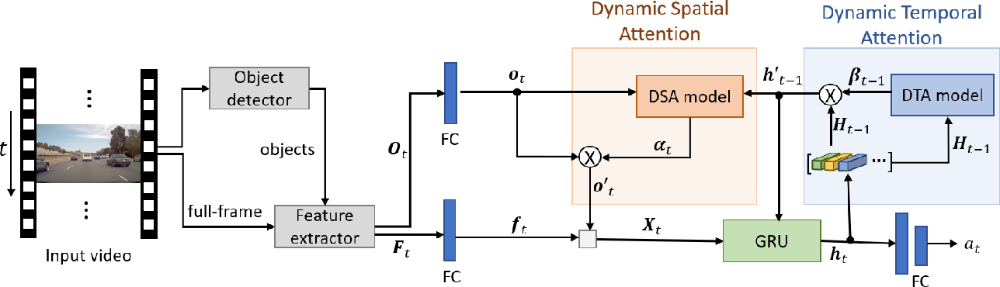

# 🚗 Predictive Accident Anticipation

## 📌 Introduction

Throughout history, innovation has been driven by humanity's relentless pursuit of safety. Despite significant advancements, **traffic accidents remain a critical global issue**, claiming over **1.35 million lives annually** (WHO). In this context, **deep learning emerges as a powerful tool** to enhance road safety by processing vast, complex datasets to anticipate and prevent accidents.

However, the success of deep learning in this domain isn't just about data analysis—it must emulate the **subtle attentiveness of human cognition**. Humans excel at interpreting nuanced cues, adapting swiftly, and recognizing potential hazards. By integrating such cognitive insights into deep learning models, we can move closer to **real-time, human-like accident anticipation**.

This project introduces a **synergistic architecture** that fuses **spatial-temporal modeling, attention mechanisms, and cutting-edge neural networks** to proactively identify and mitigate accident risks—particularly in autonomous driving systems. By leveraging **dashcam video data**, our system not only predicts accidents but aims to **proactively prevent** them.

---

## 🧠 System Architecture


### 1. YOLOv9 – Real-Time Object Detection
- **Role**: Detects and localizes multiple objects in each dashcam frame.
- **Why YOLOv9?** Known for its real-time performance and accuracy, YOLOv9 uses a single CNN to generate bounding boxes and class predictions in one forward pass. It handles multi-scale detection and object variability effectively.

### 2. EfficientNetV2 – Feature Extraction
- **Role**: Extracts deep, hierarchical features from video frames and detected objects.
- **Strengths**: Lightweight, scalable, and pre-trained on ImageNet, EfficientNetV2 efficiently encodes rich frame-level and object-level information.

### 3. DSTA Network – Dynamic Spatio-Temporal Attention

The **Dynamic Spatio-Temporal Attention (DSTA)** network forms the predictive backbone of the system and consists of the following modules:

#### 🔄 Feature Integration
- **YOLOv9** detects and localizes objects.
- **EfficientNetV2** extracts and fuses frame and object features.

#### 🔁 GRU (Gated Recurrent Unit)
- Integrates current features with historical context to form temporally aware hidden representations that forecast future risk.

#### 🧭 Attention Modules
- **Dynamic Temporal Attention (DTA)**: Weighs historical features to capture relevant motion cues over time.
- **Dynamic Spatial Attention (DSA)**: Learns to selectively focus on object features based on spatial context.
- **Temporal Self-Attention Aggregation (TSAA)**: Used during training to enhance the network’s capacity to learn video-level class semantics.

Together, these modules allow the system to **analyze evolving scenes**, capturing spatial dynamics and motion patterns to **anticipate accidents with high precision**.

---

## 📦 Dataset

The model is trained on the **Car Crash Dataset (CCD)**.  
The dataset directory should follow this structure:
```text
CarCrash/
├── Normal/   # Videos without accidents
└── Crash/    # Videos containing accidents
```
### ⚙️ Loading the Dataset
Use the `ccd_load_data` function by providing:
- The path to the dataset directory
- The path to the annotation file

---

## 🛠️ Model Training & Evaluation

### ✅ Before You Begin
- Ensure the following paths are set correctly:
  - **YOLOv9 weights** in `DSTA.py`
  - **CCD dataset** in `train_DSTA.py` and `cont_train_from_checkpoint.py`

### 🏋️ Training
To train the model from scratch:

```bash
python train_DSTA.py
```

``` bash
# Update checkpoint path inside the script first
python cont_train_from_checkpoint.py
```

## 🎯 Testing

To test the model:
1. 	Update paths in test_model.py:
- Path to the checkpoint file
-	Path to the video for testing

2.	Run the test script:

```bash
python test_model.py
```

<li> Videos to test DSTA on it found in <a href="https://drive.google.com/drive/folders/1ILrw5lAQRBWUN7sh6hHQcgV-2mpAJIUe?usp=share_link">drive</a>
</ul>

#### YOLOv9 
<ul>
<li>YOLOv9 trained on a custom dataset manually anotated on roboflow  <br>
<a href="https://universe.roboflow.com/accident-anticipating/accident-anticipation">
    </img>
</a>
<li> YOLOv9 Notebook included in the repository
<li> YOLOv9 weights included on the <a href="https://drive.google.com/file/d/153UJCTQEPKjp_sfvN3ygqQahHTXX60jc/view?usp=share_link">drive</a>
</ul>

